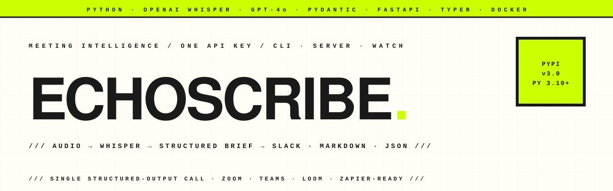

<p align="center">
  <picture>
    <source media="(prefers-color-scheme: dark)" srcset="assets/hero-banner-dark.svg" />
    
  </picture>
</p>

<p align="center">
  <a href="https://github.com/hatimhtm/EchoScribe/actions/workflows/tests.yml"></a>
  <a href="https://github.com/hatimhtm/EchoScribe/pkgs/container/echoscribe"></a>
  
  
  <a href="LICENSE"></a>
</p>

<p align="center">
  <em>Audio → Whisper → <strong>structured</strong> meeting intelligence → your tool of choice. Hand it any Zoom / Teams / Loom recording; get back a clean Markdown brief, a Slack-ready post, or a JSON payload with title, summary, decisions, action items (owner + due), participants, sentiment, and open questions. CLI, FastAPI server, or watch-a-directory daemon. One OpenAI key.</em>
</p>

---

### `/// THE PROBLEM`

Meeting recordings → action items is a five-step manual chore. Existing tools either lock you into a SaaS, want a credit card, or hand you a wall-of-text transcript and call it done. EchoScribe is **~1.2k LOC of Python** that does the chore well and gets out of the way:

```
recording.mp3
     │
     ▼
┌──────────────────┐    ┌────────────────────────────┐    ┌──────────────────┐
│ Whisper          │───▶│ GPT-4o-mini                │───▶│ Markdown · Slack │
│ (transcription)  │    │ (structured output, 1 call)│    │ · JSON · webhook │
└──────────────────┘    └────────────────────────────┘    └──────────────────┘
```

One OpenAI key powers both legs. No Google Cloud service account. No three-call summarization pipeline that string-parses bullets. One model call gated by a Pydantic schema — the model literally cannot return a malformed shape.

---

### `/// QUICK START`

```bash
pip install 'echoscribe[server,watch]'        # or just `echoscribe` for the CLI
export OPENAI_API_KEY=sk-…                    # only required env var

# Full pipeline: audio → Markdown brief on stdout
echoscribe process meeting.mp3 --format markdown

# Same, but also post to Slack
echoscribe process meeting.mp3 --slack --channel "#team-eng"

# Run as an HTTP service (POST audio, get a brief back)
echoscribe serve --port 8000

# Watch a folder — drop a Zoom recording in, it gets transcribed + summarized
echoscribe watch ~/Documents/Zoom --format markdown
```

Or via Docker, no Python install needed:

```bash
docker run --rm -p 8000:8000 -e OPENAI_API_KEY ghcr.io/hatimhtm/echoscribe:latest serve
```

---

### `/// HIGHLIGHTS`

| | |
|---|---|
| **One API key** | OpenAI handles both transcription (Whisper) and intelligence (GPT-4o-mini). No Google Cloud service-account JSON. |
| **Pydantic-validated output** | `MeetingIntelligence` schema with `title`, `summary`, `participants`, `key_points`, `decisions[]`, `action_items[]` (each with owner + due), `sentiment`, `follow_up_questions[]`. Enforced by OpenAI's structured-output API — the model can't return a malformed shape. |
| **Single call for everything** | The previous version made three sequential GPT calls and string-parsed bullets. 3.0 is one call, one schema, JSON-validated. |
| **Three surfaces** | CLI (`typer`) · FastAPI server (`POST /v1/process`) · directory watcher (`watchdog` or poll fallback). Same pipeline, three transports. |
| **Big files handled** | Files over Whisper's 25 MB cap are auto-chunked along silence boundaries with `pydub`, transcribed in pieces, and re-joined. |
| **Three output formats** | Markdown (Notion / Linear / email), Slack `mrkdwn` (channel-ready), JSON (webhooks, `jq`, downstream automation). |
| **Production Docker** | Multi-stage `python:3.12-slim` image with `ffmpeg`, non-root user, healthcheck. Published to `ghcr.io/hatimhtm/echoscribe` on every release. |
| **Real tests** | pytest matrix on 3.10 / 3.11 / 3.12, ruff + black gating, no external network calls (services are mocked, audio synthesised). |

---

### `/// 3.0 — WHAT CHANGED FROM 2.0`

- **Transcription**: Google Cloud Speech-to-Text → **OpenAI Whisper**. One API key for the whole pipeline instead of juggling a service-account JSON.
- **Summarization**: three sequential GPT-3.5 calls with string parsing → **one structured-output call** with a Pydantic schema enforced by OpenAI's `response_format`. Cheaper, faster, validated.
- **Removed**: the half-broken in-app mic recorder (continuous mode never actually captured audio). EchoScribe now positions itself as a **post-meeting** tool — Zoom / Teams / Loom / phone recorders / `ffmpeg` already do the recording.
- **New**: `echoscribe serve` — FastAPI app with `/v1/transcribe`, `/v1/intelligence`, `/v1/process` endpoints. Zapier / n8n / cron-friendly.
- **New**: `echoscribe watch ./dir` — point it at a folder, every new audio file gets a `.brief.md` next to it.
- **New**: output formatters — `markdown`, `slack` (mrkdwn), `json` are all rendered from the same `MeetingIntelligence` object.
- **Model default**: `gpt-3.5-turbo` → `gpt-4o-mini`. ~10× the reasoning quality at ~half the price.
- **Docker**: rebuilt on `python:3.12-slim`, multi-stage, non-root user, healthcheck, auto-published to GHCR on tagged releases.
- **CI**: split test (matrix 3.10/3.11/3.12) and lint (`ruff` + `black --check`), Docker build job runs on push-to-main + tagged release.

---

### `/// CLI`

```
echoscribe transcribe AUDIO [--output FILE] [--language en-US]
echoscribe intelligence TRANSCRIPT [--format markdown|slack|json] [--slack]
echoscribe process AUDIO [--format markdown|slack|json] [--slack] [--save-transcript]
echoscribe serve [--host 0.0.0.0] [--port 8000]
echoscribe watch DIR [--format markdown|slack|json] [--slack]
echoscribe check-config
echoscribe version
```

---

### `/// HTTP API`

```bash
# Full pipeline — POST a file, get a JSON brief back
curl -F file=@meeting.mp3 -F format=json \
  http://localhost:8000/v1/process

# Transcription only — returns plain text
curl -F file=@meeting.mp3 http://localhost:8000/v1/transcribe

# Intelligence on an existing transcript — returns the structured object
curl -F transcript="$(cat transcript.txt)" http://localhost:8000/v1/intelligence

# Health
curl http://localhost:8000/healthz
```

---

### `/// PROJECT LAYOUT`

```
echoscribe/
├── __init__.py                       package exports
├── cli.py                            Typer CLI (transcribe/intelligence/process/serve/watch/…)
├── config.py                         dataclass-based env config
├── output.py                         to_markdown · to_slack · to_json
├── server.py                         FastAPI app — /v1/transcribe · /v1/intelligence · /v1/process
├── watch.py                          watchdog (or poll) directory watcher
└── services/
    ├── transcription.py              Whisper client + >25 MB silence-aware chunking
    ├── intelligence.py               MeetingIntelligence pydantic model + 1-call extraction
    └── slack.py                      slack-sdk wrapper

tests/                                pytest, no network — services mocked, audio synthesised
.github/workflows/tests.yml           matrix test + lint + GHCR docker publish on tag
Dockerfile                            python:3.12-slim · ffmpeg · non-root · healthcheck
pyproject.toml                        hatchling · 3.10+ · [server], [watch], [dev] extras
```

---

### `/// LOCAL DEV`

```bash
git clone https://github.com/hatimhtm/EchoScribe.git
cd EchoScribe

python -m venv .venv && source .venv/bin/activate
pip install -e ".[dev]"

pytest                                  # matrix-equivalent run
ruff check echoscribe tests             # lint
black --check echoscribe tests          # format check

cp .env.example .env.local
# add your OPENAI_API_KEY, then:
echoscribe check-config
```

---

### `/// LICENSE`

[MIT](LICENSE). Use it however you want — including commercially.

---

<p align="center">
  <a href="https://hatimelhassak.is-a.dev"></a>
  <a href="https://cal.com/hatimelhassak/engineering-discovery"></a>
  <a href="https://www.linkedin.com/in/hatim-elhassak/"></a>
  <a href="mailto:hatimelhassak.official@gmail.com"></a>
</p>

<p align="center">
  <code>///&nbsp;&nbsp;OPEN FOR NEW WORK&nbsp;&nbsp;///&nbsp;&nbsp;CONTRACT &amp; FREELANCE&nbsp;&nbsp;///&nbsp;&nbsp;REMOTE WORLDWIDE&nbsp;&nbsp;///</code>
</p>
